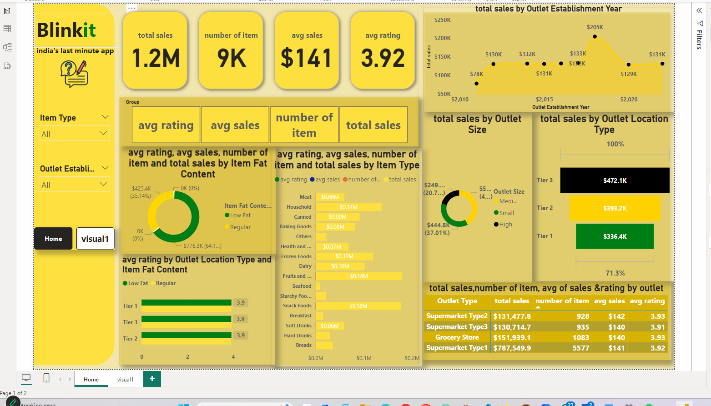
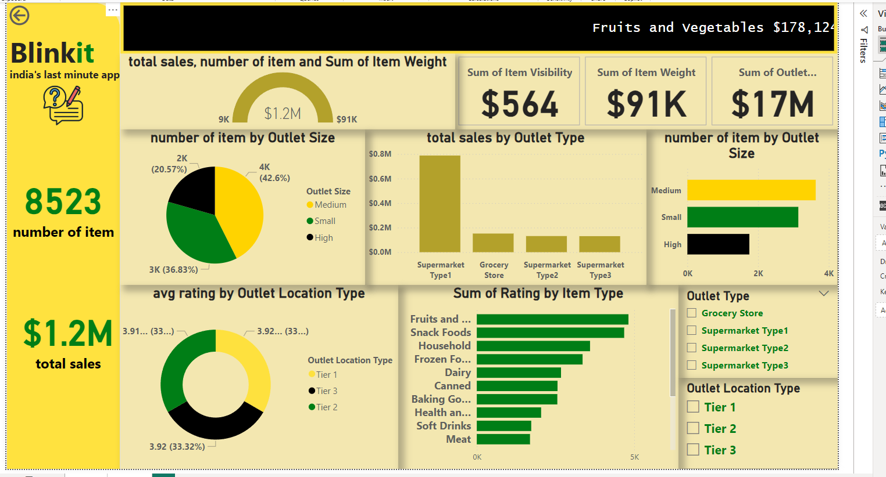

# 📊 Sales and Outlet Performance Analysis

Welcome to the **Sales and Outlet Performance Analysis** project! This project, created in Power BI, provides an in-depth exploration of sales and outlet performance data through engaging and interactive visualizations.

## 🚀 Key Features of the Analysis

- **💰 Total Sales and Item Analysis**:  
  Visualized **total sales**, **number of items sold**, and **item weight**.

- **⭐ Outlet Ratings**:  
  Showcased average outlet ratings to understand customer satisfaction levels.

- **🏬 Performance by Outlet Attributes**:  
  Examined performance by **outlet type**, **size**, and **location**.

- **📈 Sales Trends Over Time**:  
  Analyzed sales trends to identify patterns and growth opportunities.

- **📊 Key Metrics**:  
  - Average ratings  
  - Sales by item type  
  - Total sales by establishment year

## 🧐 Insights Gained

This analysis offered actionable insights into:
- 📦 **Product and Outlet Performance**  
- 🌍 **Regional and Outlet-Type Sales Trends**  
- 📅 **Temporal Sales Patterns**

## 📁 Files and Resources

- Data: `sales_outlet_data.csv`
- Dashboards and Visualizations:  
  - Sales Overview Dashboard (`sales_dashboard.png`)  
  - Outlet Performance Dashboard (`outlet_performance_dashboard.png`)

## 📊 Visualization Example

Here's a glimpse of one of the dashboards:

---

Feel free to explore the dashboards and leverage the insights for data-driven decision-making! 😊
